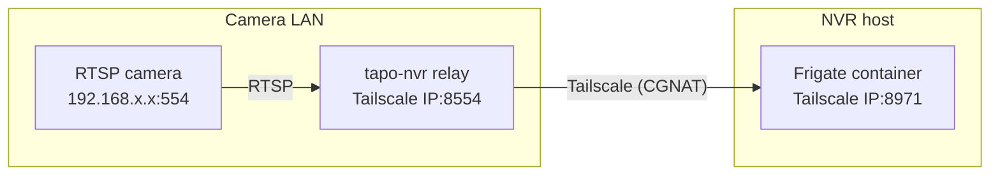

# tapo-nvr

[](https://github.com/Arudchayan/tapo-nvr/actions/workflows/ci.yml)
[](LICENSE)
[](pyproject.toml)

`tapo-nvr` connects a self-hosted [Frigate](https://frigate.video/) NVR to a
camera that lives on a different network. A small TCP relay runs next to the
camera and exposes **only the camera's RTSP port** on that host's
[Tailscale](https://tailscale.com/) address, so the camera's LAN is never
routable from the tailnet.

It was built for a TP-Link Tapo C220 but the relay is camera-agnostic: any
RTSP source works. It has been running 24/7 on Windows (relay) and Arch Linux
(Frigate in Docker); treat other combinations as beta and please report what
works.

## Why a relay instead of a subnet route?

Advertising a camera subnet route means every device on your tailnet can reach
every device on the camera LAN, usually including the camera's web UI and ONVIF
endpoints. A relay narrows the exposure to a single TCP port and lets Tailscale
ACLs be the access control layer. See
[docs/architecture.md](docs/architecture.md) for the full design.

## Architecture



- **Relay host** runs `tapo-nvr relay` plus Tailscale. It does not need router
  access, port forwarding, or IP forwarding.
- **NVR host** runs Tailscale and the Frigate Docker container. `tapo-nvr`
  manages the container over SSH from the relay host.

## Requirements

Relay host:

- Python 3.10 or newer (`python3` on Linux/macOS; on Debian/Ubuntu install
  `python3-venv` before creating a virtual environment)
- Tailscale, signed in to your tailnet
- Same LAN as the camera

NVR host:

- Docker Engine, with the SSH user allowed to run `docker` without `sudo`
  (typically `sudo usermod -aG docker <user>`, then log out and back in)
- Tailscale, signed in to the same tailnet
- Optional: `/dev/dri/renderD128` for VAAPI hardware acceleration

Both:

- The camera's *Camera Account* enabled (for Tapo cameras this is separate from
  the TP-Link cloud account; set it up in the Tapo app under the camera's
  settings).
- SSH access from the relay host to the NVR host. Key authentication is
  preferred; the NVR host key must be in `known_hosts` when
  `NVR_STRICT_HOST_KEY_CHECKING=true` (the default). See
  [docs/configuration.md](docs/configuration.md#nvr-host).

The management commands run from the relay host and reach the NVR host over
SSH.

## Quick start

### 1. Install

```bash
git clone https://github.com/Arudchayan/tapo-nvr.git
cd tapo-nvr
python3 -m venv .venv

# Linux/macOS
source .venv/bin/activate

# Windows PowerShell
.venv\Scripts\Activate.ps1

pip install .
```

On Windows, if activation is blocked by the execution policy, run
`Set-ExecutionPolicy -Scope Process RemoteSigned` once per session.

You can also install it as an isolated CLI with [pipx](https://pipx.pypa.io/):

```bash
pipx install .
```

### 2. Configure

```bash
cp .env.example .env    # Windows: Copy-Item .env.example .env
```

Edit `.env` and set the camera address and credentials, a Tailscale-reachable
NVR host, and SSH details. Every setting is documented in
[docs/configuration.md](docs/configuration.md). The relay reads this file by
default; command-line flags override it.

### 3. Start the relay on the relay host

```bash
tapo-nvr relay            # reads CAMERA_HOST, RELAY_* from .env
tapo-nvr relay --target 192.168.1.50   # or pass everything explicitly
```

To run it automatically:

```powershell
# Windows: boot-time task + firewall rule (elevated PowerShell).
# Keep PYTHON_PATH pointed at the interpreter that has tapo_nvr installed.
deploy\windows\install-relay.ps1

# Windows: no-admin fallback
deploy\windows\install-relay-user-startup.ps1
```

```bash
# Linux: systemd (install the package into a venv the service can read)
sudo mkdir -p /opt/tapo-nvr
sudo python3 -m venv /opt/tapo-nvr/venv
sudo /opt/tapo-nvr/venv/bin/pip install .
sudo install -D -m 0644 deploy/systemd/tapo-nvr-relay.service /etc/systemd/system/tapo-nvr-relay.service
sudo install -D -m 0644 deploy/systemd/relay.env.example /etc/tapo-nvr/relay.env
sudoedit /etc/tapo-nvr/relay.env   # set CAMERA_HOST and PYTHON=/opt/tapo-nvr/venv/bin/python3
sudo systemctl daemon-reload
sudo systemctl enable --now tapo-nvr-relay
```

More detail, including uninstall steps, is in
[docs/service-installation.md](docs/service-installation.md).

### 4. Deploy Frigate on the NVR host

```bash
# Preview the generated configuration and container command first
tapo-nvr deploy --dry-run

# Write the configuration and (re)create the container over SSH
tapo-nvr deploy
```

### 5. Verify

```bash
tapo-nvr inspect          # JSON health checks, exits non-zero on failures
tapo-nvr fetch-clip       # downloads the newest recording
```

## Commands

| Command | Description |
| --- | --- |
| `tapo-nvr deploy` | Render the Frigate config, write it over SSH, and (re)create the container. Use `--dry-run` to preview and `--no-pull` to skip `docker pull`. |
| `tapo-nvr inspect` | JSON health checks for the camera, relay, Tailscale, container, image, and recent Frigate logs. `--scope local` or `--scope remote` narrows the checks. |
| `tapo-nvr fetch-clip` | Download the most recent MP4 from the NVR storage directory. |
| `tapo-nvr relay` | Run the camera-only TCP relay. Reads `.env` by default; see `tapo-nvr relay --help`. |

`deploy`, `inspect`, and `fetch-clip` accept `--env PATH`; `relay` does too.

## Security model

- The relay binds to a local address and, by default, accepts clients only from
  `100.64.0.0/10` (the Tailscale CGNAT range) and only forwards a single TCP
  port to the camera.
- Camera credentials are transferred over SSH and written to a mode `0600`
  environment file on the NVR host. They never appear in the Frigate YAML,
  which references them through `{FRIGATE_*}` placeholders.
- SSH host keys are verified by default (`NVR_STRICT_HOST_KEY_CHECKING=true`).
- No router ports are opened and no camera subnet route is advertised.
- `tapo-nvr inspect` and `tapo-nvr deploy` redact credentials from any output
  they print.

See [SECURITY.md](SECURITY.md) for the threat model, hardening
recommendations, and an example Tailscale ACL.

## Documentation

- [Configuration reference](docs/configuration.md)
- [Architecture and threat model](docs/architecture.md)
- [Installing the relay as a service](docs/service-installation.md)
- [Troubleshooting](docs/troubleshooting.md)

## Contributing

Contributions are welcome. See [CONTRIBUTING.md](CONTRIBUTING.md) and
[CODE_OF_CONDUCT.md](CODE_OF_CONDUCT.md).

## License

[MIT](LICENSE)
